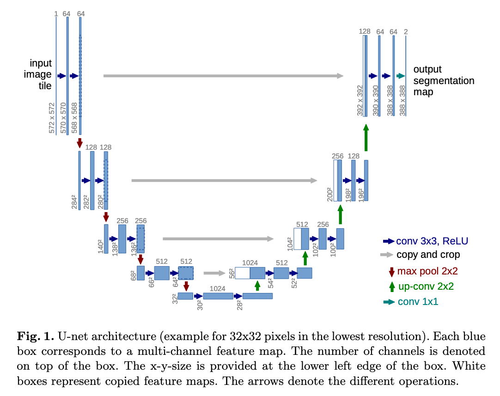
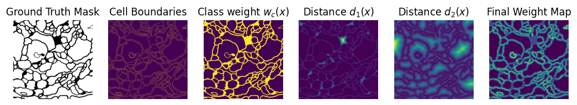
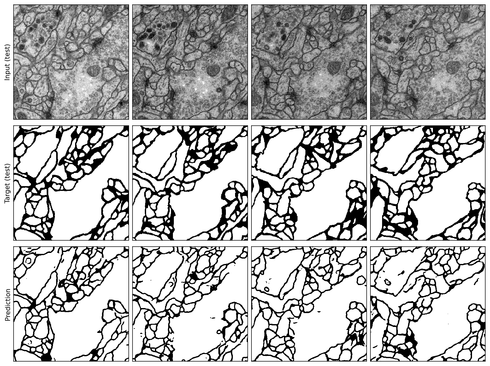

# U-Net
PyTorch reimplementation of the **U-Net** architecture for image segmentation, originally introduced in the paper ["U-Net: Convolutional Networks for Biomedical Image Segmentation"](https://lmb.informatik.uni-freiburg.de/Publications/2015/RFB15a/), Ronneberger, Brox and Fischer (2015).

<p align="center">
  
</p>

<p align="center">
  <em>
    U-Net architecture from 
    <a href="https://lmb.informatik.uni-freiburg.de/Publications/2015/RFB15a/">
      “U-Net: Convolutional Networks for Biomedical Image Segmentation”
    </a>
    by Ronneberger, Fischer, and Brox (2015).
  </em>
</p>

## Usage

```python
import torch
from src import UNet


unet = UNet(in_channels=1, out_channels=2)

# input shape [4, 1, 572, 572]
input = torch.rand((4, 1, 572, 572))

# output shape [4, 2, 388, 388]
output = unet(input)
```

## Reproducing the ISBI-2012 challange: Segmentation of neuronal structures in EM stacks
The ISBI-2012 challange ["Segmentation of neuronal structures in EM stacks"](https://imagej.net/events/isbi-2012-segmentation-challenge) was part of a workshop 
held in conjunction with the IEEE International Symposium on Biomedical Imaging (ISBI) 2012 challange. 

Given a full stack of EM slices, the goal is to produce a full segmentation of the neuronal structures. You can fine more details in my notebook [ISBI_2012_demo.ipynb](./ISBI_2012_demo.ipynb), or [here](https://imagej.net/events/isbi-2012-segmentation-challenge).

Read more in ["U-Net: Convolutional Networks for Biomedical Image Segmentation"](https://lmb.informatik.uni-freiburg.de/Publications/2015/RFB15a/) to get more information about training details, especially for the weight map.

<p align="center">
  
</p>

<p align="center">
  <em>
    Visualization of the U-Net weight-map construction: original mask, cell boundaries,
    class-balancing weights, distance maps d<sub>1</sub> and d<sub>2</sub>, and the final weight map.
  </em>
</p>

## Training

Train the model:

```bash
python3 train.py --epochs=100 --learning_rate=0.001 --momentum=0.99 --batch_size=1 --w0=10.0 --sigma=5.0 --device=cuda --num_workers=2 --seed=0 --verbose=True
```

#### U-Net Inference on Test Data

<p align="center">
  
</p>

<p align="center">
  <em>
    Example U-Net inference segmentations on electron microscopy stacks.
  </em>
</p>

## Experimental Setup

* OS: Fedora Linux 42 (Workstation Edition) x86_64
* CPU: AMD Ryzen 5 2600X (12) @ 3.60 GHz
* GPU: NVIDIA GeForce RTX 3060 TI (8GB)
* RAM: 32 GB DDR4 3200 MHz

## Citations

```bibtex
@InProceedings{RFB15a,
  author       = "O. Ronneberger and P.Fischer and T. Brox",
  title        = "U-Net: Convolutional Networks for Biomedical Image Segmentation",
  booktitle    = "Medical Image Computing and Computer-Assisted Intervention (MICCAI)",
  series       = "LNCS",
  volume       = "9351",
  pages        = "234--241",
  year         = "2015",
  publisher    = "Springer",
  note         = "(available on arXiv:1505.04597 [cs.CV])",
  url          = "http://lmb.informatik.uni-freiburg.de/Publications/2015/RFB15a"
}
```

```bibtex
@misc{isbi2012challenge,
  title        = {Segmentation of Neuronal Structures in EM Stacks Challenge --- ISBI 2012},
  author       = {Ignacio Arganda-Carreras and Sebastian Seung and Albert Cardona and Johannes Schindelin},
  year         = {2012},
  howpublished = {Challenge workshop at the IEEE International Symposium on Biomedical Imaging (ISBI)},
  note         = {Barcelona, Spain, May 2--5, 2012. \url{https://imagej.net/events/isbi-2012-segmentation-challenge}},
}
```